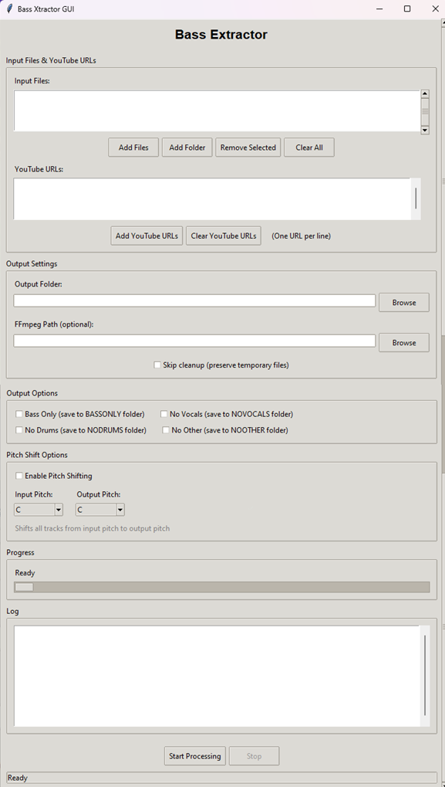

# Bass Extractor

A Python script and GUI to extract bass from audio files or Youtube directly (single or in batches) and changing pitch, using command line interface and GUI. **This project is based on [Spleeter](https://github.com/deezer/spleeter)**, an open-source audio separation library by Deezer.

**Testing Status**: The script and GUI are currently tested on Windows. Linux and macOS compatibility is implemented but requires testing.

## ✨ **New Features (Latest Update)**

### 🎵 **YouTube Download Support**
- **Download YouTube videos** directly as MP3 files using pytubefix
- **Multiple URL support** - process multiple YouTube videos at once
- **Automatic conversion** to MP3 format using FFmpeg
- **Integrated workflow** - downloaded videos are processed like local files

### 🎼 **Pitch Shift Support**
- **Musical note selection** - choose input and output pitches (C, D, E, F, G, A, B, etc.)
- **All tracks shifted** - bass, drums, vocals, and other instruments
- **FFmpeg integration** - high-quality pitch shifting using FFmpeg
- **Fallback support** - pydub fallback if FFmpeg not available


## Installation

### Python Version Requirement

This project requires Python 3.10.0. Spleeter is not compatible with higher Python versions.

#### Using pyenv (Recommended)

1. Install pyenv:
   - **Windows**: Download from [pyenv-win](https://github.com/pyenv-win/pyenv-win)
   - **macOS/Linux**: `brew install pyenv` or follow [pyenv installation guide](https://github.com/pyenv/pyenv#installation)

2. Install Python 3.10.0:
   ```bash
   pyenv install 3.10.0
   pyenv global 3.10.0 # or pyenv local 3.10.0 to apply only to current folder and subfolders
   ```

3. Verify the installation:
   ```bash
   python --version
   # Should output: Python 3.10.0
   ```

### Dependencies

1. Install required Python packages:
   ```bash
   pip install -r requirements.txt
   ```

   Or install individually:
   ```bash
   pip install pydub>=0.25.1
   pip install spleeter>=2.3.0
   pip install pytubefix>=9.4.1 # For YouTube download functionality
   ```

   **Note**: This project uses and relies on [Spleeter](https://github.com/deezer/spleeter) for audio separation. Visit their GitHub page for more information about the tool and its capabilities.

### FFmpeg Installation

FFmpeg is required for audio processing and YouTube video conversion. Installation depends on your operating system:

#### Windows
1. Download FFmpeg from [https://ffmpeg.org/download.html](https://ffmpeg.org/download.html)
2. Extract to a folder (e.g., `C:\ffmpeg`)
3. Add the `bin` folder to your system PATH, OR
4. Use the GUI to specify the path to ffmpeg.exe

**Note**: If you encounter issues installing Spleeter on Windows even after manual FFmpeg installation, try:
```bash
pip uninstall ffmpeg
pip uninstall ffmpeg-python
pip install ffmpeg-python
```

#### macOS
```bash
# Using Homebrew (recommended)
brew install ffmpeg

# Or download from https://ffmpeg.org/download.html
# Make sure to add it to your PATH or specify the path in the GUI
```

#### Linux
```bash
sudo apt update
sudo apt install ffmpeg
```

## Usage

### GUI Interface (Recommended)

The easiest way to use Bass Extractor is through the graphical interface:



*The Bass Extractor GUI showing file selection, YouTube URL input, pitch shift options, and processing controls.*

#### Windows:
```bash
gui/extract_bass_gui.bat
```

#### Linux:
```bash
./gui/extract_bass_gui.sh
```

#### macOS:
```bash
# Terminal
./gui/extract_bass_gui.sh

# Double-click (if you make the .command file executable)
./gui/extract_bass_gui.command
```

#### Direct Python:
```bash
python gui/extract_bass_gui.py
```

### GUI Features

The enhanced GUI provides:

#### 📂 **File Management**
- **Add Files** - Select individual MP3 files
- **Add Folder** - Process all MP3 files in a folder
- **Remove Selected** - Remove specific files from the list
- **Clear All** - Clear all selected files

#### 🎵 **YouTube Integration**
- **YouTube URL Input** - Text area for entering multiple URLs (one per line)
- **URL Validation** - Real-time validation of YouTube URLs
- **Add YouTube URLs** - Validate and add URLs to processing list
- **Clear YouTube URLs** - Remove all YouTube URLs

#### ⚙️ **Processing Options**
- **Output Folder** - Select where processed files will be saved
- **FFmpeg Path** - Specify custom FFmpeg executable path
- **Skip Cleanup** - Preserve temporary files for debugging
- **Output Options**:
  - **Bass Only** - Save to BASSONLY folder
  - **No Vocals** - Save to NOVOCALS folder
  - **No Drums** - Save to NODRUMS folder
  - **No Other** - Save to NOOTHER folder
- **Pitch Shift Options**:
  - **Enable Pitch Shifting** - Toggle pitch shift functionality
  - **Input Pitch** - Select source musical note (C, D, E, F, G, A, B, etc.)
  - **Output Pitch** - Select target musical note (C, D, E, F, G, A, B, etc.)

#### 📊 **Progress Tracking**
- **Real-time progress** - Shows current processing status
- **Live log output** - Detailed processing information
- **Status bar** - Shows file counts and processing state

### Command Line Interface

For advanced users or automation, the command line interface is available:

#### Using the Python script directly:
```bash
python extract_bass.py --folder /path/to/music --output_folder /path/to/output
python extract_bass.py --file song1.mp3 --file song2.mp3 --output_folder /path/to/output
```

#### Using the batch file (Windows):
```bash
extract_bass.bat --folder /path/to/music --output_folder /path/to/output
extract_bass.bat --file song1.mp3 --file song2.mp3 --output_folder /path/to/output
```

#### Using the shell script (Unix/Linux/macOS):
```bash
./extract_bass.sh --folder /path/to/music --output_folder /path/to/output
./extract_bass.sh --file song1.mp3 --file song2.mp3 --output_folder /path/to/output
```

## Arguments

- `--folder folder_name`: Process all MP3 files in the specified folder
- `--file file_name`: Process individual MP3 files (can be used multiple times)
- `--output_folder`: Required. Specify the output folder for processed files
- `--ffmpeg path`: Optional. Path to ffmpeg executable (if not in PATH)
- `--nocleanup`: Optional. Skip cleanup of temporary files (useful for debugging)
- `--bassonly`: Optional. Also save bass track to BASSONLY folder (default behavior only creates NOBASS)
- `--novocals`: Optional. Remove vocals and save to NOVOCALS folder
- `--nodrums`: Optional. Remove drums and save to NODRUMS folder
- `--noother`: Optional. Remove other instruments and save to NOOTHER folder

## YouTube Download Usage

### Supported URL Formats
- `https://www.youtube.com/watch?v=VIDEO_ID`
- `https://youtu.be/VIDEO_ID`
- `https://www.youtube.com/watch?v=VIDEO_ID`
- `https://www.youtube.com/embed/VIDEO_ID`

### How to Use YouTube Downloads

1. **Launch the GUI**
2. **Enter YouTube URLs** in the text area (one URL per line)
3. **Click "Add YouTube URLs"** to validate and add them
4. **Set output folder** and processing options
5. **Click "Start Processing"**
6. **Videos will be downloaded** as MP3 files first, then processed for bass extraction

### Example YouTube URLs
```
https://www.youtube.com/watch?v=dQw4w9WgXcQ
https://youtu.be/dQw4w9WgXcQ
https://www.youtube.com/watch?v=jNQXAC9IVRw
```

## Pitch Shifting Usage

### How to Use Pitch Shifting

1. **Enable Pitch Shifting** - Check the "Enable Pitch Shifting" checkbox
2. **Select Input Pitch** - Choose the original key of your audio (e.g., C, D, E, F, G, A, B)
3. **Select Output Pitch** - Choose the target key for the processed audio
4. **Process files** - All tracks (bass, drums, vocals, other) will be pitch-shifted together

### Supported Musical Notes
- **Natural notes**: C, D, E, F, G, A, B
- **Sharp notes**: C#, D#, F#, G#, A#
- **All tracks shifted** - Bass, drums, vocals, and other instruments are all pitch-shifted together
- **Quality processing** - Uses FFmpeg for high-quality pitch shifting with pydub fallback

### Example Pitch Shifts
- **C to D**: Transpose up by 2 semitones
- **G to C**: Transpose down by 5 semitones
- **A to F**: Transpose down by 3 semitones
- **Same note**: No pitch shift applied (e.g., C to C)

## Error Logging

The script automatically logs all errors and processing information to `error.log` in the current directory. This includes:
- Spleeter initialization errors
- Audio separation failures
- File processing errors
- YouTube download errors
- Cleanup issues
- Processing statistics

Check this file if you encounter any issues during processing.

## Rules

- If `--folder` is specified, all `--file` arguments will be ignored
- You must specify either `--folder` or `--file` (or multiple `--file` arguments)
- The `--output_folder` argument is always required
- YouTube URLs are processed in addition to local files

## Examples

```bash
# Process all MP3 files in a folder
extract_bass --folder ./music --output_folder ./output

# Process individual files
extract_bass --file song1.mp3 --file song2.mp3 --output_folder ./output

# Process multiple individual files
extract_bass --file track1.mp3 --file track2.mp3 --file track3.mp3 --output_folder ./processed

# Specify FFmpeg path (Windows example)
extract_bass --folder ./music --output_folder ./output --ffmpeg "C:\ffmpeg\bin\ffmpeg.exe"

# Specify FFmpeg path (macOS/Linux example)
extract_bass --file song.mp3 --output_folder ./output --ffmpeg "/usr/local/bin/ffmpeg"

# Skip cleanup to preserve temporary files (useful for debugging)
extract_bass --folder ./music --output_folder ./output --nocleanup

# Create bass-only track
extract_bass --file song.mp3 --output_folder ./output --bassonly

# Remove specific tracks and save to separate folders
extract_bass --file song.mp3 --output_folder ./output --novocals
extract_bass --file song.mp3 --output_folder ./output --nodrums
extract_bass --file song.mp3 --output_folder ./output --noother

# Combine multiple options
extract_bass --file song.mp3 --output_folder ./output --bassonly --novocals
```

## Output Structure

For each input file, the script will create output files in separate subfolders:

### 📁 **Output Folders**

**Default behavior:**
- `{output_folder}/NOBASS/{original_filename}.mp3` - The original song without bass (drums + vocals + other instruments mixed together)

**With `--bassonly`:**
- `{output_folder}/BASSONLY/{original_filename}.mp3` - Only the bass track extracted from the original song

**With `--novocals`:**
- `{output_folder}/NOVOCALS/{original_filename}.mp3` - The original song without vocals (bass + drums + other instruments mixed together)

**With `--nodrums`:**
- `{output_folder}/NODRUMS/{original_filename}.mp3` - The original song without drums (bass + vocals + other instruments mixed together)

**With `--noother`:**
- `{output_folder}/NOOTHER/{original_filename}.mp3` - The original song without other instruments (bass + vocals + drums mixed together)

### 📁 **DONE Folder**
- `{output_folder}/DONE/{original_filename}.mp3` - Original input files moved here after processing
- `{output_folder}/DONE/{original_filename}_YYYYMMDD_HHMMSS.mp3` - If filename conflicts exist

## How it works

1. **YouTube Download** (if URLs provided):
   - Downloads YouTube videos using pytubefix
   - Converts to MP3 format using FFmpeg
   - Adds downloaded files to processing list

2. **Audio Separation**:
   - Uses Spleeter Python API to separate the audio into 4 stems: bass, drums, vocals, and other
   - Mixes drums, vocals, and other together to create the "no bass" version
   - Extracts the bass track separately

3. **File Processing**:
   - Exports files in MP3 format to the output folder
   - Creates appropriate subfolders based on options
   - Moves original input files to DONE folder

4. **Cleanup**:
   - Cleans up temporary files automatically (unless --nocleanup is specified)
   - Logs all errors and processing information to `error.log`

## Troubleshooting

### YouTube Download Issues
- **Install pytubefix**: `pip install pytubefix`
- **Update pytubefix**: `pip install --upgrade pytubefix`
- **Check internet connection** - required for downloads
- **Try different videos** - some may be restricted
- **Check FFmpeg installation** - required for video conversion

### General Issues
- **Check Python version**: Must be 3.10.0
- **Verify FFmpeg installation**: `ffmpeg -version`
- **Check error.log**: Detailed error information
- **Try --nocleanup**: Preserves temporary files for debugging

## Legal Considerations

- **YouTube Terms**: Users must comply with YouTube's terms of service
- **Copyright**: Users are responsible for respecting copyright laws
- **Personal Use**: Intended for personal use only
- **No Redistribution**: Downloaded content should not be redistributed

## Requirements Summary

- **Python**: 3.10.0 (required for Spleeter compatibility)
- **pydub**: `pip install pydub>=0.25.1`
- **spleeter**: `pip install spleeter>=2.3.0`
- **pytubefix**: `pip install pytubefix>=9.4.1` (for YouTube functionality)
- **FFmpeg**: Must be installed and in PATH (or specify path in GUI)
- **Internet Connection**: Required for YouTube downloads 